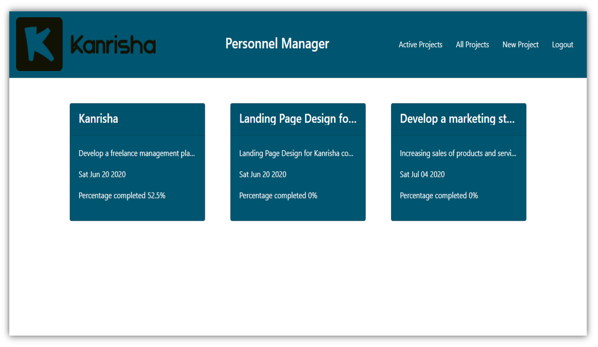
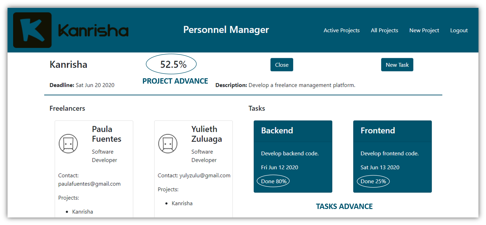
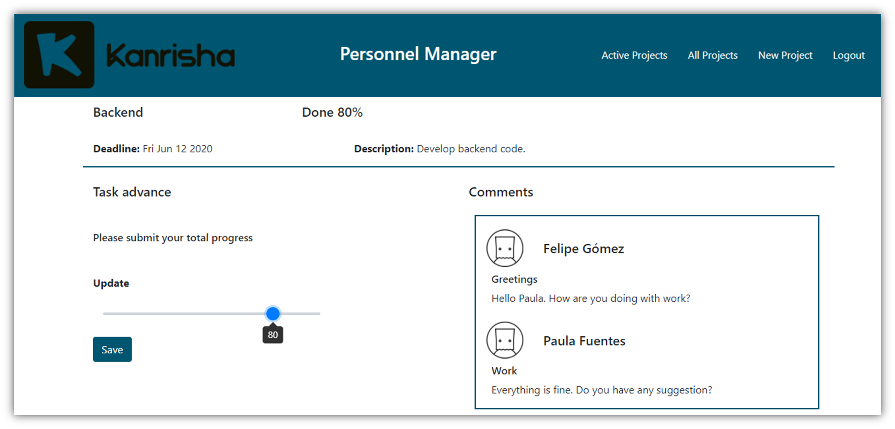

# Kanrisha

Kanrisha is a freelance management platform. In which a manager can create projects and tasks, assign freelancers to tasks, put weight on tasks, see the progress of each task and project, and comment on tasks. The freelancer can see the projects and tasks that they participate in, they can put the progress of their tasks and comment on the tasks.  

## Inspiration
Two of our members have worked as independent, and they had to gather with their bosses to check their progress in the project assigned, losing time and money.  

The other one used to work as freelancer and most of the time she didn't have a direct contact with her project manager, she would only receive requirements and do her job.  

Covid-19 has made our lifestyle virtual, communication problems and internet connection are now in our daily business life. Therefore having meetings to check how freelancers are doing could be tiring mostly if an executive has thousands of freelancers.  

Kanrisha has born from the necessity to manage a big amount of freelancers, without having lots of intermediaries o doing a lot of paperwork to know how they are doing in their tasks.  

## Deploy
To interact with the app you will need this credentials.  
Manager- email: manager@gmail.com, password: 123456  
Freelancer- email: freelancer@gmail.com, password: 123456  
Go to the following path to interact with the application:
```
https://kanrisha.herokuapp.com/
```
## Features
Kanrisha platform features:
### Manage your projects
You can create projects with their respective tasks and add freelancers to them.


### Check your projects and tasks progress
You can watch how your projects and tasks advance; the app allows your freelancers to update their progress.


### Communicate with you freelancers
You can communicate with your freelancers about a specific task to solve doubts or make some suggestions.


## Directories
We have two directories to run the platform:  
**Backend**: responsible for managing and manipulating the database and **Frontend**: that is the visual part of the platform, which takes data from the backend to display dynamic content.

## Requirements
To run the program you will need **node** and **npm** installed globally on your machine. Also **Mongodb** to store the database.


## Instructions

### Clone repository
To clone the repository, you must type the following command:
```
$ git clone https://github.com/shincap8/Kanrisha.git
```


### Installation

You need to open two consoles, one to run the backend and one to run the frontend. In one console enter the backend directory and with the other console enter the frontend directory, in both consoles you must execute the command:

```
$ npm install
```
This command will download the packages necessary to run the program.

## Execution

### Backend Execution
Enter the backend directory and type the following command:
```
$ npm run dev
```

### Frontend Execution
Enter the frontend directory and type the following command:

```
$ npm run start
```
### Browser
Make sure that the browser you use is Google Chrome.

## Consider
For the use of the platform we assume that the database is already created.  
For this reason, before interacting with the platform and with the 3001 server of the backend on, you must create the manager and freelancer users as follows:  
Use an app to test a REST API like Postman or Insomnia.

### Manager
To create a manager you need to make a POST request to the route:
```
http://localhost:3001/signUp/manager
```
#### Example
```
{
	"name": "managerName",
	"email": "managerEmail@gmail.com",
	"password": "password"
}
```
### Freelancer
To create a freelancer you need to make a POST request to the route:
```
http://localhost:3001/signUp/freelancer
```
#### Example
```
{
	"name": "freelancerName",
	"email": "freelancerEmail@gmail.com",
	"password": "password",
	"profession": "FreelancerProfession"
}
```

## Technologies
### JavaScript

JavaScript is among the most powerful and flexible programming languages of the web. It powers the dynamic behavior on most websites.
MongoDB is a document database, which means it stores data in JSON-like documents.
### NodeJs
The powerful Node.js runtime environment has been ranked the technology most commonly used by professional developers. Node.js is an event-driven JavaScript runtime. Node has myriad potential uses for JavaScript development including being a great environment for building efficient network applications.
### npm
npm is a package manager for the JavaScript programming language. It is the default package manager for the JavaScript runtime environment Node.js.
### ReactJs
ReactJS presents graceful solutions to some of front-end programming’s most persistent issues. It’s fast, scalable, flexible, powerful, and has a robust developer community that’s rapidly growing.
### Express
Express will help you build APIs in JavaScript and implement the CRUD (create, retrieve, update, and delete) functionality which forms the backbone of modern-day apps.
### MongoDB
MongoDB is a document database, which means it stores data in JSON-like documents.

## Developed with
- npm: 6.14.5
- node: v14.2.0
- mongodb: 4.2.6

## Learnings about Kanrisha
If you want to know more about the learning we had with this project, visit our blogs at the following links:
```
https://www.linkedin.com/pulse/learnings-kanrisha-my-final-project-holberton-school-zuluaga-g%25C3%25B3mez/?trackingId=bXhVMBzMQS%2Blxzikw%2FqpVQ%3D%3D
```
```
https://www.linkedin.com/pulse/kanrisha-my-final-project-holbert-school-paula-fuentes/?trackingId=kpbHfsHLSliyUFkAkSAUVg%3D%3D
```

## Authors
- Paula Fuentes [Github](https://github.com/pafuentess) [LinkedIn](https://www.linkedin.com/in/paula-fuentes-5a1473192/)
- Sara Hincapie [Github](https://github.com/shincap8) [LinkedIn](https://www.linkedin.com/in/sara-hincapi%C3%A9-monsalve-180063107/)
- Yulieth Zuluaga [Github](https://github.com/yulyzulu) [LinkedIn](https://www.linkedin.com/in/yulieth-zuluaga-g%C3%B3mez-b97145122/)